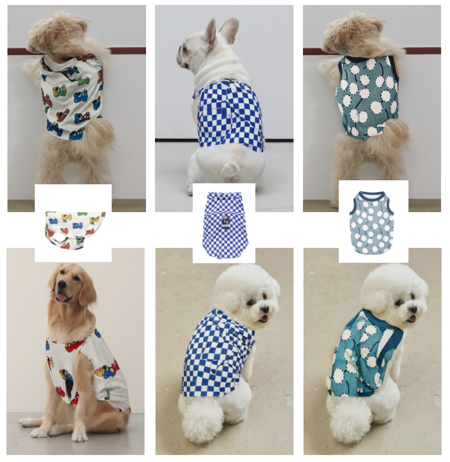

# AnimalVITON: Virtual Try-On for Dogs Using Latent Diffusion Model
Please note that all codes references the official implementation of [OOTDiffusion](https://github.com/levihsu/OOTDiffusion)
&nbsp;

## Installation
1. Clone the repository

```sh
git clone https://github.com/vdnuit/AnimalVITON
```

2. Install the required packages

```sh
pip install torch==2.0.1 torchvision==0.15.2 torchaudio==2.0.2
pip install -r requirements.txt
pip install ultralytics
pip install config einops onnxruntime diffusers==0.24.0 accelerate==0.26.1
```
3. Download checkpoints

The three types of checkpoints [OOTDiffusion Checkpoints](https://huggingface.co/levihsu/OOTDiffusion), [clip-vit-large-patch14](https://huggingface.co/openai/clip-vit-large-patch14), [AnimalVITON_model](https://huggingface.co/skush1/AnimalVITON_model) should be placed under the OOTDiffusion/OOTDiffusion/checkpoints folder.
Below is the code for it.

```sh
git lfs install
git clone https://huggingface.co/levihsu/OOTDiffusion
git clone https://huggingface.co/openai/clip-vit-large-patch14
git clone https://huggingface.co/skush1/AnimalVITON_model
mv AnimalVITON_model/yolo-cloth OOTDiffusion/checkpoints/humanparsing OOTDiffusion/checkpoints/ootd OOTDiffusion/checkpoints/openpose clip-vit-large-patch14 AnimalVITON/OOTDiffusion/OOTDiffusion/checkpoints/

#Use custom checkpoints (Optional)
mv AnimalVITON_model/ootd-train/unet_garm-epoch99.safetensors AnimalVITON/OOTDiffusion/OOTDiffusion/checkpoints/ootd/ootd_hd/checkpoint-36000/unet_garm/diffusion_pytorch_model.safetensors
mv AnimalVITON_model/ootd-train/unet_vton-epoch99.safetensors AnimalVITON/OOTDiffusion/OOTDiffusion/checkpoints/ootd/ootd_hd/checkpoint-36000/unet_vton/diffusion_pytorch_model.safetensors

```

## Inference
> `<model-image-path>`: Path to the image of the dog that will virtually try on the clothes (e.g. `examples/model/model_2.jpg`)  
> `<cloth-image-path>`: Path to the image of the dog clothing for virtual try-on (e.g. `examples/garment/garment_1.jpg`)

```sh
cd AnimalVITON/OOTDiffusion/OOTDiffusion/run
python run_ootd.py --model_path <model-image-path> --cloth_path <cloth-image-path> --scale 2.0 --sample 4
```
The results can be found in the run/images_output directory. This may take up to 5 minutes.
For more details, please refer to [here](OOTDiffusion/OOTDiffusion.ipynb).

## Train
### YOLO-Seg Training for Mask Generator

First, download the dataset from [this link](https://huggingface.co/datasets/skush1/AnimalVITON_dataset) and place the Dog_Cloth_Segmentation folder inside the `YOLO_Seg/datasets` folder.

```sh
yolo task=segment mode=train model=yolov8n-seg.pt data=datasets/Dog_Cloth_Segmentation/data.yaml epochs=100 imgsz=800 plots=True
```
For more details, please refer to [here](YOLO_Seg/train.ipynb).

### OOTDiffusion Training
Please note that the training code references [this repo](https://github.com/lyc0929/OOTDiffusion-train).

First, download the dataset from [this link](https://huggingface.co/datasets/skush1/AnimalVITON_dataset) and unzip the file dog-garment-pair-dataset.zip.

> `<root-dir-path>`: e.g. `/workspace/AnimalVITON/OOTDiffusion/OOTDiffusion`
> `<dataset-path>`: e.g. `/workspace/AnimalVITON_dataset/dog-garment-pair-dataset`

```sh
!accelerate launch ootd_train.py --load_height 512 --load_width 384 --root_dir <root-dir-path>  --dataset_dir <dataset-path> --dataset_list 'train_pairs.txt' --dataset_mode 'train' --batch_size 4 --train_batch_size 4 --num_train_epochs 100
```
For more details, please refer to [here](OOTDiffusion/OOTD-train.ipynb).